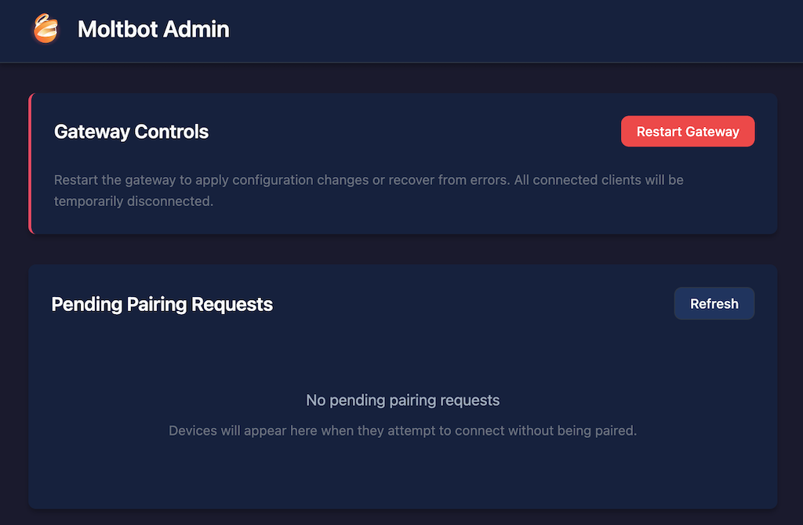

# Moltbot on Cloudflare Workers — Personal AI Gateway

> A fully deployed personal AI assistant running on Cloudflare's edge infrastructure.
> Live at: **[moltbot-sandbox.yk846.workers.dev](https://moltbot-sandbox.yk846.workers.dev)**



---

## What This Is

This project runs [OpenClaw](https://github.com/openclaw/openclaw) (an open-source personal AI assistant, formerly called Moltbot) inside a **Cloudflare Container Sandbox** — Cloudflare's new serverless container runtime. The worker acts as a secure gateway between the public internet and the container running the AI agent.

I took the open-source base project and deployed, configured, and extended it — including adding features that don't exist in the original.

---

## What I Deployed & Configured

### Infrastructure
- **Cloudflare Workers** (paid plan) — serverless compute at the edge
- **Cloudflare Containers** — a `standard-1` container (½ vCPU, 4 GiB RAM) running the OpenClaw gateway process
- **Cloudflare R2** — S3-compatible object storage for persisting conversation history and device config across container restarts
- **Cloudflare Access** — Zero-trust auth layer protecting the admin UI and all `/api/admin/*` routes, with JWT verification via JWKS
- **Cloudflare Browser Rendering** — headless Chrome binding for browser automation via CDP

### Secrets & Environment
Configured the following secrets via `wrangler secret put`:
- `ANTHROPIC_API_KEY` — Claude API access for the AI agent
- `MOLTBOT_GATEWAY_TOKEN` — gateway access token (hex-generated)
- `CF_ACCESS_TEAM_DOMAIN` / `CF_ACCESS_AUD` — Cloudflare Access JWT validation
- `R2_ACCESS_KEY_ID` / `R2_SECRET_ACCESS_KEY` / `CF_ACCOUNT_ID` — R2 persistent storage
- `TELEGRAM_BOT_TOKEN` — Telegram bot channel integration

### Architecture

```
Browser / Telegram / Discord
        │
        ▼
┌───────────────────────────┐
│   Cloudflare Worker       │  ← TypeScript + Hono framework
│   (Edge — global PoP)     │
│                           │
│  ┌─────────────────────┐  │
│  │  CF Access Auth     │  │  ← JWT verification (JWKS)
│  └─────────────────────┘  │
│  ┌─────────────────────┐  │
│  │  Admin UI  /_admin/ │  │  ← React SPA (Vite build)
│  └─────────────────────┘  │
│  ┌─────────────────────┐  │
│  │  API Routes         │  │  ← Device pairing, gateway control
│  └─────────────────────┘  │
│  ┌─────────────────────┐  │
│  │  WebSocket Proxy    │  │  ← Forwards to container gateway
│  └─────────────────────┘  │
└───────────┬───────────────┘
            │  Durable Object / Container API
            ▼
┌───────────────────────────┐
│  Cloudflare Container     │  ← Docker-based sandbox (standard-1)
│  OpenClaw Gateway         │
│  (Node.js process)        │
│                           │
│  Persistent workspace:    │
│  ~/.openclaw/             │  ← synced to R2 on demand
│  ~/clawd/skills/          │
└───────────────────────────┘
```

---

## Features I Added

### 1. Live Gateway Status Bar
Added a real-time status indicator to the admin UI that shows whether the gateway container is running, with a pulsing green dot when online. Polls the new `/api/admin/status` endpoint.

**Files changed:** `src/client/pages/AdminPage.tsx`, `src/client/pages/AdminPage.css`

### 2. Auto-Refresh with Countdown
The Pending Pairing Requests section now auto-refreshes every 30 seconds with a live countdown and "Updated Ns ago" timestamp — no manual clicking required.

**Files changed:** `src/client/pages/AdminPage.tsx`

### 3. `/api/admin/status` Endpoint
A new lightweight API endpoint that returns combined gateway + storage status in a single fast call (no CLI invocation, just process detection + env var checks). Designed for polling by external monitoring tools.

```json
{
  "gateway": { "running": true, "processId": 42 },
  "storage": { "configured": false },
  "timestamp": "2026-03-23T18:00:00Z"
}
```

**Files changed:** `src/routes/api.ts`

### 4. CORS on Public Status Endpoint
Added `Access-Control-Allow-Origin: *` to `GET /api/status` so external pages and widgets can poll it without a CORS proxy.

**Files changed:** `src/routes/public.ts`

### 5. Standalone Status Page Widget
Built a zero-dependency, self-contained HTML status page (`status-page/index.html`) that:
- Connects to any Moltbot instance via a URL input or `?url=` query param
- Shows real-time gateway health with an animated pulse indicator
- Tracks response latency, check count, and session uptime %
- Auto-refreshes every 30 seconds with a countdown
- Generates an `<iframe>` embed snippet so you can drop it into any portfolio or dashboard

**Try it:** Open `status-page/index.html` locally and point it at `https://moltbot-sandbox.yk846.workers.dev`.

---

## Tech Stack

| Layer | Technology |
|-------|-----------|
| Runtime | Cloudflare Workers (V8 isolates) |
| Container | Cloudflare Sandbox (Docker-compatible) |
| Framework | [Hono](https://hono.dev/) (ultra-lightweight web framework) |
| Frontend | React 19 + Vite 6 |
| Language | TypeScript (strict) |
| Storage | Cloudflare R2 (via rclone) |
| Auth | Cloudflare Access (JWT/JWKS) |
| AI | Anthropic Claude (via `ANTHROPIC_API_KEY`) |
| Testing | Vitest |
| Linting | oxlint + oxfmt |

---

## Local Development

```bash
# Clone and install
git clone https://github.com/KleinYaron/moltbot-sandbox
cd moltbot-sandbox
npm install

# Configure secrets (copy and fill in)
cp .dev.vars.example .dev.vars

# Run the admin UI (Vite, port 5173)
npm run dev

# Run the worker locally (Wrangler, port 8787)
npm run start

# Run tests
npm test
```

> **Note:** Local dev runs with `enable_containers: false` (no Docker required). The container sandbox only runs when deployed to Cloudflare.

---

## Deployment

```bash
# Deploy to Cloudflare Workers
npm run deploy

# Set required secrets
wrangler secret put ANTHROPIC_API_KEY
wrangler secret put MOLTBOT_GATEWAY_TOKEN
wrangler secret put CF_ACCESS_TEAM_DOMAIN
wrangler secret put CF_ACCESS_AUD

# Optional: R2 persistent storage
wrangler secret put R2_ACCESS_KEY_ID
wrangler secret put R2_SECRET_ACCESS_KEY
wrangler secret put CF_ACCOUNT_ID

# Optional: Telegram bot
wrangler secret put TELEGRAM_BOT_TOKEN
```

---

## Cost

Running 24/7 on a `standard-1` container: ~$34.50/month. With `SANDBOX_SLEEP_AFTER=10m` configured, idle cost drops to ~$10/month.

| Resource | Cost |
|----------|------|
| Workers Paid plan | $5/mo |
| Container memory (4 GiB) | ~$26/mo |
| Container CPU (~10% util) | ~$2/mo |
| Container disk (8 GB) | ~$1.50/mo |

---

## Skills Demonstrated

- **Cloudflare ecosystem** — Workers, Containers, R2, Access, Browser Rendering, Durable Objects
- **Full-stack TypeScript** — Hono (backend) + React 19 (frontend), both in one Workers project
- **React patterns** — `useCallback`, `useEffect`, interval-based polling, optimistic UI updates
- **REST API design** — layered auth middleware, typed responses, public vs protected routes
- **Security** — Zero-trust auth via Cloudflare Access JWT, secret management with Wrangler
- **DevOps** — Dockerfile, Wrangler config, CI-ready project structure, R2 backup strategy
- **Testing** — Vitest unit tests across auth, gateway, R2, and process management modules

---

## Project Structure

```
src/
├── index.ts          # Main Worker entry point (Hono app)
├── routes/           # HTTP handlers (public, admin API, admin UI, debug, CDP)
├── gateway/          # Container process lifecycle + R2 sync
├── auth/             # Cloudflare Access JWT middleware
├── client/           # React admin UI (built by Vite → dist/client)
│   ├── pages/AdminPage.tsx   # Device management UI
│   └── api.ts               # Typed API client
└── types.ts          # Shared TypeScript interfaces

status-page/
└── index.html        # Standalone status widget (zero dependencies)
```

---

*Based on [OpenClaw](https://github.com/openclaw/openclaw) (Apache 2.0). Extended with live status monitoring, auto-refresh UI, and a standalone status page widget.*
